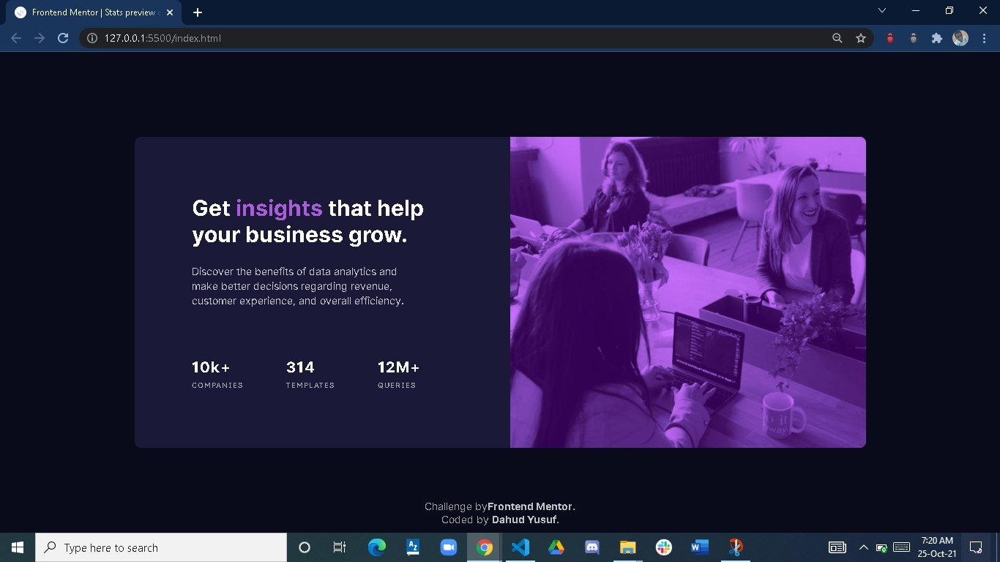

# Frontend Mentor - Stats preview card component solution

This is a solution to the [Stats preview card component challenge on Frontend Mentor](https://www.frontendmentor.io/challenges/stats-preview-card-component-8JqbgoU62). Frontend Mentor challenges help you improve your coding skills by building realistic projects. 

## Table of contents

- [Overview](#overview)
  - [The challenge](#the-challenge)
  - [Screenshot](#screenshot)
  - [Links](#links)
- [My process](#my-process)
  - [Built with](#built-with)
  - [What I learned](#what-i-learned)
  - [Continued development](#continued-development)
  - [Useful resources](#useful-resources)
- [Author](#author)


## Overview

### The challenge

Users should be able to:

- View the optimal layout depending on their device's screen size

### Screenshot




### Links

- Solution URL: (https://github.com/yusfate4/preview-card-component.git)
- Live Site URL: (https://previewcard1.netlify.app/)

## My process

### Built with

- Semantic HTML5 markup
- CSS custom properties
- Flexbox
- CSS Grid
- Mobile-first workflow


### What I learned

I learned how to create an overlay effect with CSS.

To see how you can add code snippets, see below:

```html
<h1>Some HTML code I'm proud of</h1>
```
```css
.proud-of-this-css {
  color: papayawhip;
}
```
```js
const proudOfThisFunc = () => {
  console.log('🎉')
}
```

### Continued development

I would focus more on css overlay


### Useful resources

- [Example resource 1](https://https://www.w3schools.com/howto/howto_css_overlay.asp) - This helped me to create an overlay effect with CSS. I really liked this pattern and will use it going forward.
- [Example resource 2](https://www.https://tympanus.net/codrops/2013/11/07/css-overlay-techniques/) - This is an amazing article which helped me finally understand CSS Overlay Techniques. I'd recommend it to anyone still learning this concept.


## Author

- Website - [Dahud Yusuf Ishola](https://www.github/yusfate4)
- Frontend Mentor - [@yusfate4](https://www.frontendmentor.io/profile/yusfate4)
- Twitter - [@yusfate4](https://www.twitter.com/yusfate4)
